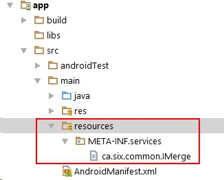

Router3 is a simple Router framework. 

Source code of Router framework is in the "common" module, which only has two classes : IMerge and Router3 class.

[**Import**]

1. After you import the Router3, you just need to create a new class which implements IMerge interface. In this class, you add the path you defined and the activity class.

2. Then at the "app" (main) module, you need to create a configuration file, just like this:



The content of this configuration file is just the name of all the classes you just created for each module.

3. At last, you init the Router in your application
```java
public class Ar_App extends Application {
    @Override
    public void onCreate() {
        super.onCreate();
        Router3.getInstance().init();
    }
}
```

[**Use it**]

1. the easiest way
```java
        Router3.getInstance().go(this, "mod1");
```
    
2. add arguments and intent flag
```java
        Router3.getInstance()
                .addFlag(Intent.FLAG_ACTIVITY_CLEAR_TASK | Intent.FLAG_ACTIVITY_NEW_TASK)
                .addBundle(bundle)
                .go(this, "mod1");
```

3. jump to multiple places
```java
Router3.getInstance().go(this, "login/verify/third");
```

In the middle places, such as LoginActivity, when you login successfully, you just call 
```java
Router3.getInstance().rego(this);
```
to make the Router to continue navigating.
